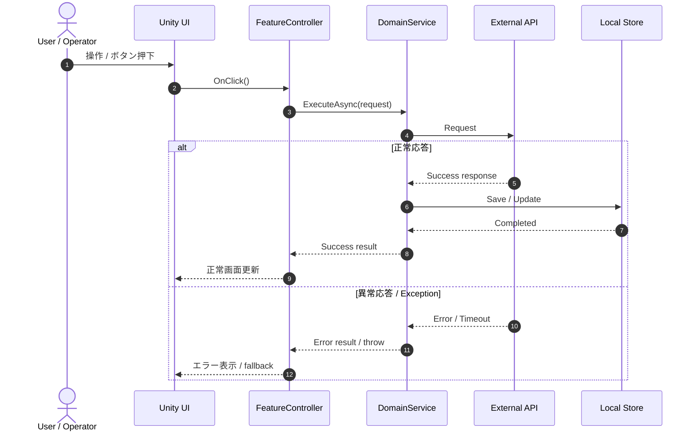
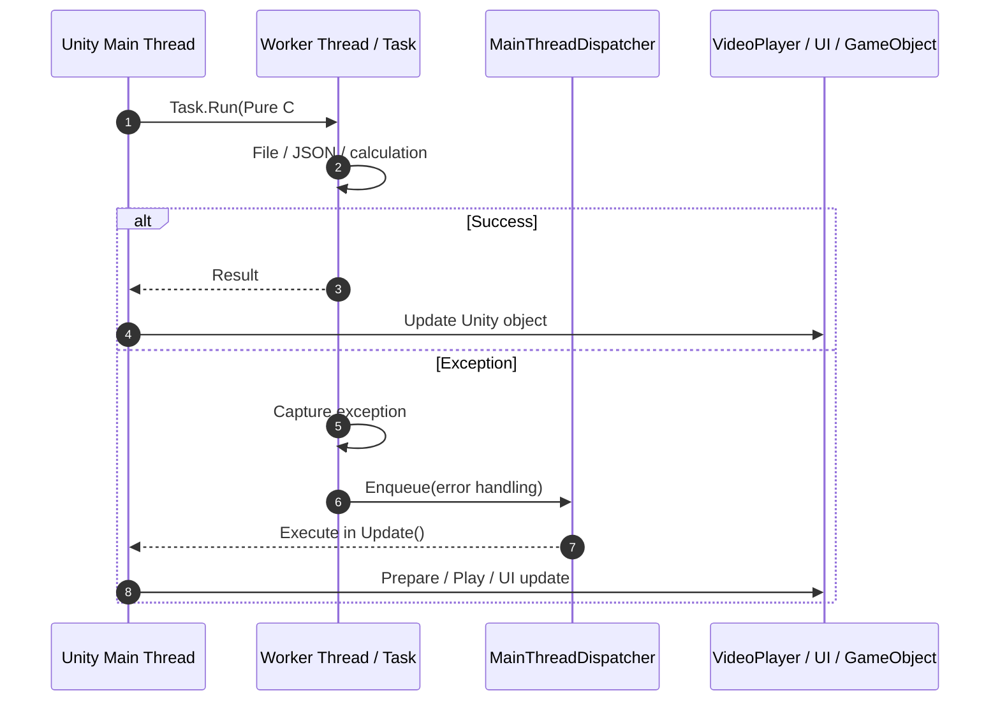
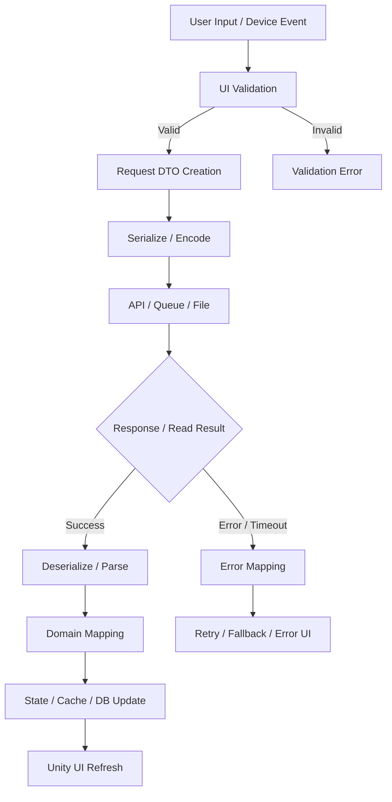
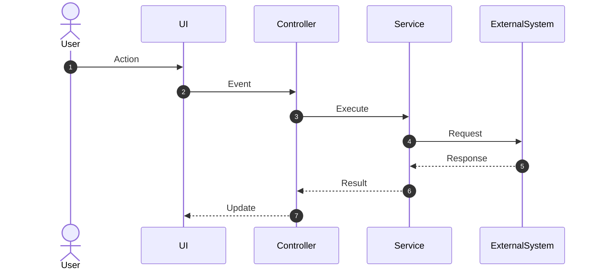
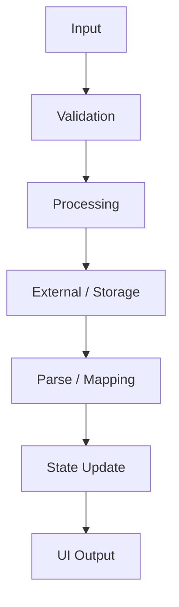

# Unity / C# 现场 Issue 调查分析方法

> 版本：1.0  
> 更新日期：2026-08-24  
> 适用范围：Unity / C# 项目的故障、功能异常、通信错误、异步/线程问题、数据异常、Scene/Prefab 绑定问题  
> 目标：通过 PowerShell 批量生成可追溯的代码线索，由 Copilot 365 辅助整理假设，再由开发人员验证并形成 Root Cause Report。

---

## 1. 基本原则

调查流程不是“让 AI 猜原因”，而是建立下面的证据闭环：

```text
Issue / 仕様 / Log / Debug 信息
    ↓
PowerShell 批量检索代码、Scene、Prefab
    ↓
生成标准化 grep 结果文件
    ↓
Copilot 365 整理事实、原因候补、证据与待确认项
    ↓
开发人员回到 VS Code / Unity / 实机进行验证
    ↓
确认 Root Cause、修正方针、影响范围与测试观点
```

角色分工：

```text
PowerShell    负责大范围、可重复的关键字检索
Copilot 365   负责整理线索、生成假设和图表草案
开发人员      负责验证假设、确认原因和最终判断
最终报告      必须区分“确认事实 / 推测 / 未确认”并注明依据
```

### 1.1 调查状态的统一标记

| 标记 | 含义 | 使用条件 |
|---|---|---|
| `确认済み / Confirmed` | 已确认事实 | 有 Log、代码、仕様、Debug 或再现结果支撑 |
| `推測 / Hypothesis` | 原因假设 | 线索吻合，但尚未用实验或代码路径确认 |
| `未確認 / Unverified` | 当前资料无法判断 | 缺少日志、代码、环境、再现条件或外部系统信息 |
| `否定済み / Ruled out` | 已排除 | 通过实验、代码路径或日志明确排除 |

---

## 2. 标准目录结构

每个 Issue 建立一个独立调查目录：

```text
Issue_Investigation/
└─ ISSUE_YYYYMMDD_ShortName/
   ├─ 00_input/
   │  ├─ 00_issue_summary.md
   │  ├─ 01_spec_related.md
   │  ├─ 02_log_masked.txt
   │  ├─ 03_reproduction_steps.md
   │  ├─ 04_environment.md
   │  └─ 05_debug_notes.md
   ├─ 01_grep_results/
   │  ├─ 00_grep_run_summary.txt
   │  ├─ 01_grep_business_keywords.txt
   │  ├─ 02_grep_ui_event.txt
   │  ├─ 03_grep_communication.txt
   │  ├─ 04_grep_async_queue_thread.txt
   │  ├─ 05_grep_error_handling.txt
   │  ├─ 06_grep_unity_thread_risk.txt
   │  ├─ 07_grep_data_storage.txt
   │  ├─ 08_grep_parser_format.txt
   │  ├─ 09_grep_scene_prefab_binding.txt
   │  └─ 10_grep_methods_index.txt
   ├─ 02_copilot_output/
   │  ├─ 01_copilot_analysis.md
   │  ├─ 02_sequence_diagram.md
   │  ├─ 03_data_flow.md
   │  └─ 04_followup_grep.md
   └─ 03_confirmed_result/
      ├─ root_cause_report.md
      └─ evidence/
```

示例：

```text
Issue_Investigation/ISSUE_20260824_HoldResumeError/
```

### 2.1 目录职责

| 目录 | 内容 | 注意事项 |
|---|---|---|
| `00_input` | Issue、仕様、日志、环境、再现步骤、Debug 记录 | 日志必须去除账号、Token、个人信息等敏感数据 |
| `01_grep_results` | PowerShell 自动生成的检索结果 | 原则上不手工修改，保持可重复性 |
| `02_copilot_output` | Copilot 365 的分析、图表、追加检索建议 | 属于分析草案，不等于确认结论 |
| `03_confirmed_result` | 人工验证后的最终报告与证据 | 只写已验证结论；未确认项必须明确保留 |

---

## 3. 输入文件命名与模板

### 3.1 `00_issue_summary.md`

```markdown
# Issue Summary

## 基本信息
- Issue ID：
- 标题：
- 发现日期：
- 报告者：
- 当前状态：调查中 / 原因确认 / 修正中 / 测试中 / 完了
- 优先级：Critical / High / Medium / Low

## 事象
- 发生了什么：
- 发生时间：
- 发生频率：每次 / 偶发 / 仅一次 / 未知

## 期待结果
-

## 实际结果
-

## 影响范围
- 用户影响：
- 功能影响：
- 数据影响：
- 设备 / OS / Unity 版本：

## 当前已知信息
-

## 当前未知信息
-
```

### 3.2 `01_spec_related.md`

记录相关仕様，不要只粘贴整份文档。保留章节名、页面、版本和引用范围。

```markdown
# Related Specification

## 文档信息
- 文档名：
- 版本：
- 更新日期：
- 相关章节 / 页面：

## 相关仕様摘要
-

## 期待的处理顺序
1.
2.
3.

## 异常时的期待动作
-
```

### 3.3 `02_log_masked.txt`

```text
[时间] [级别] [线程/模块] 消息

注意：
- 保留原始时间顺序和 Error 前后的上下文。
- 对 Token、密码、账号、姓名、URL 参数等进行脱敏。
- 不要只保留最后一行 Exception；同时保留 stack trace。
```

### 3.4 `03_reproduction_steps.md`

```markdown
# Reproduction Steps

## 前置条件
-

## 操作步骤
1.
2.
3.

## 再现结果
- 再现：成功 / 失败 / 偶发
- 次数：__ / __
- 发生时间：
- 对应日志：

## 对照实验
- 正常条件：
- 异常条件：
- 唯一差异：
```

### 3.5 `04_environment.md`

```markdown
# Environment

- Git branch / commit：
- Unity Editor 版本：
- Scripting Backend：Mono / IL2CPP
- API Compatibility Level：
- OS / 设备：
- Build 类型：Editor / Development / Release
- 网络环境：
- 后端 / API 环境：
- 相关 Package 版本：
- 与正常环境的差异：
```

### 3.6 `05_debug_notes.md`

```markdown
# Debug Notes

| 时间 | 操作 / 实验 | 结果 | 判断 | 证据位置 |
|---|---|---|---|---|
| | | | Confirmed / Hypothesis / Ruled out | |
```

---

## 4. Grep 输出文件命名

| 文件名 | 检索目的 |
|---|---|
| `00_grep_run_summary.txt` | 执行时间、根目录、业务关键字、各文件命中数 |
| `01_grep_business_keywords.txt` | 保留、支付、取消、会计等 Issue 固有业务关键字 |
| `02_grep_ui_event.txt` | 按钮、`OnClick`、`AddListener`、`UnityEvent` 等入口 |
| `03_grep_communication.txt` | API 请求、响应、序列化、状态码、超时处理 |
| `04_grep_async_queue_thread.txt` | `async`、`Task`、队列、线程、Coroutine、UniTask |
| `05_grep_error_handling.txt` | `try/catch/throw`、异常、错误日志、失败分支 |
| `06_grep_unity_thread_risk.txt` | 子线程调用 Unity API 的潜在风险 |
| `07_grep_data_storage.txt` | PlayerPrefs、文件、DB、缓存、Save / Load |
| `08_grep_parser_format.txt` | Parse、Substring、Split、JSON、编码和格式转换 |
| `09_grep_scene_prefab_binding.txt` | Scene / Prefab 中的组件、GUID、按钮绑定 |
| `10_grep_methods_index.txt` | C# 方法入口索引，用于快速建立调用路径 |

输出行采用统一格式：

```text
Assets/Scripts/Feature/HoldController.cs:128: await service.ResumeAsync(transactionId);
```

格式为：

```text
相对路径:行号: 原始代码行
```

---

## 5. PowerShell grep 模板

将以下内容保存为 Unity 项目根目录下的 `grep_issue_template.ps1`。项目根目录通常包含 `Assets`、`Packages` 和 `ProjectSettings`。

```powershell
param(
    [Parameter(Mandatory = $false)]
    [string]$RootPath = ".",

    [Parameter(Mandatory = $false)]
    [string]$OutputDir = ".\01_grep_results",

    [Parameter(Mandatory = $false)]
    [string]$BusinessPattern =
        "保留|保留解除|Hold|Unhold|Suspend|Resume|Pending|Temp|Transaction|Cart|Payment|Receipt"
)

$ErrorActionPreference = "Stop"

$resolvedRoot = (Resolve-Path -LiteralPath $RootPath).Path
$resolvedOutput = [System.IO.Path]::GetFullPath($OutputDir)

New-Item -ItemType Directory -Path $resolvedOutput -Force | Out-Null

# Unity / IDE / build 生成目录。以目录名判断，避免误排除同名文件。
$excludedDirectoryNames = @(
    "Library", "Temp", "Obj", "Build", "Builds", "Logs",
    "UserSettings", ".git", ".vs", ".idea", "bin", "obj"
)

function Test-IsExcludedPath {
    param([Parameter(Mandatory = $true)][string]$FullName)

    $relativePath = ConvertTo-RelativePath -BasePath $resolvedRoot -TargetPath $FullName
    $segments = $relativePath -split '[\\/]'

    foreach ($segment in $segments) {
        if ($excludedDirectoryNames -contains $segment) {
            return $true
        }
    }

    return $false
}

# Windows PowerShell 5.1 兼容的相对路径转换。
function ConvertTo-RelativePath {
    param(
        [Parameter(Mandatory = $true)][string]$BasePath,
        [Parameter(Mandatory = $true)][string]$TargetPath
    )

    $baseWithSeparator = $BasePath.TrimEnd('\', '/') + [System.IO.Path]::DirectorySeparatorChar
    $baseUri = [System.Uri]::new($baseWithSeparator)
    $targetUri = [System.Uri]::new($TargetPath)
    $relativeUri = $baseUri.MakeRelativeUri($targetUri)

    return [System.Uri]::UnescapeDataString($relativeUri.ToString()).Replace(
        '/',
        [System.IO.Path]::DirectorySeparatorChar
    )
}

function Get-TargetFiles {
    param([Parameter(Mandatory = $true)][string[]]$Extensions)

    Get-ChildItem -LiteralPath $resolvedRoot -Recurse -File | Where-Object {
        $extensionMatched = $Extensions -contains $_.Extension.ToLowerInvariant()
        $extensionMatched -and -not (Test-IsExcludedPath -FullName $_.FullName)
    }
}

$runResults = [System.Collections.Generic.List[object]]::new()

function Invoke-Grep {
    param(
        [Parameter(Mandatory = $true)][string]$Pattern,
        [Parameter(Mandatory = $true)][string]$OutputFile,
        [Parameter(Mandatory = $true)][string[]]$Extensions
    )

    Write-Host "Grep start: $OutputFile"

    $outputPath = Join-Path $resolvedOutput $OutputFile
    $files = @(Get-TargetFiles -Extensions $Extensions)
    $matches = @(
        $files |
            Select-String -Pattern $Pattern -CaseSensitive:$false |
            ForEach-Object {
                $relativePath = ConvertTo-RelativePath `
                    -BasePath $resolvedRoot `
                    -TargetPath $_.Path
                "${relativePath}:$($_.LineNumber): $($_.Line.Trim())"
            }
    )

    if ($matches.Count -eq 0) {
        "# No matches" | Out-File -LiteralPath $outputPath -Encoding utf8
    }
    else {
        $matches | Out-File -LiteralPath $outputPath -Encoding utf8
    }

    $runResults.Add([pscustomobject]@{
        File       = $OutputFile
        Scanned    = $files.Count
        MatchCount = $matches.Count
    })

    Write-Host "Grep finished: $OutputFile ($($matches.Count) matches)"
}

# 01. Issue 固有业务关键词
Invoke-Grep `
    -Pattern $BusinessPattern `
    -OutputFile "01_grep_business_keywords.txt" `
    -Extensions @(".cs")

# 02. UI 事件 / 按钮入口
Invoke-Grep `
    -Pattern "OnClick|Button|onClick|AddListener|UnityEvent|Clicked|Click|押下" `
    -OutputFile "02_grep_ui_event.txt" `
    -Extensions @(".cs")

# 03. 通信处理
Invoke-Grep `
    -Pattern "UnityWebRequest|HttpClient|Request|Response|Post|Get|Send|Receive|Deserialize|Parse|FromJson|JsonConvert|ResultCode|ErrorCode|StatusCode|Timeout" `
    -OutputFile "03_grep_communication.txt" `
    -Extensions @(".cs")

# 04. 异步 / 队列 / 线程
Invoke-Grep `
    -Pattern "async|await|Task\.Run|TaskCompletionSource|Queue|ConcurrentQueue|Enqueue|Dequeue|Thread|ThreadPool|CancellationToken|SemaphoreSlim|Coroutine|StartCoroutine|IEnumerator|UniTask" `
    -OutputFile "04_grep_async_queue_thread.txt" `
    -Extensions @(".cs")

# 05. 异常处理
Invoke-Grep `
    -Pattern "try|catch|throw|Exception|Error|Failed|Failure|失敗|エラー|Debug\.LogError|Debug\.LogWarning" `
    -OutputFile "05_grep_error_handling.txt" `
    -Extensions @(".cs")

# 06. Unity 主线程风险候补
Invoke-Grep `
    -Pattern "Task\.Run|new\s+Thread|ThreadPool|VideoPlayer|Play\(|Prepare\(|Stop\(|GameObject|SetActive|RawImage|RenderTexture|AudioSource|Instantiate|Destroy|SceneManager|Transform" `
    -OutputFile "06_grep_unity_thread_risk.txt" `
    -Extensions @(".cs")

# 07. 数据保存
Invoke-Grep `
    -Pattern "PlayerPrefs|File\.|Directory\.|JsonUtility|Save|Load|Repository|Cache|Local|DB|SQLite|Database|Storage" `
    -OutputFile "07_grep_data_storage.txt" `
    -Extensions @(".cs")

# 08. 解析 / 格式转换
Invoke-Grep `
    -Pattern "Parse|TryParse|Substring|Split|Deserialize|FromJson|JsonConvert|int\.Parse|decimal\.Parse|DateTime\.Parse|Enum\.Parse|Convert\.To|Encoding" `
    -OutputFile "08_grep_parser_format.txt" `
    -Extensions @(".cs")

# 09. Scene / Prefab 绑定
Invoke-Grep `
    -Pattern "m_Name|m_Script|OnClick|onClick|Button|MonoBehaviour|guid|fileID" `
    -OutputFile "09_grep_scene_prefab_binding.txt" `
    -Extensions @(".prefab", ".unity")

# 10. 方法入口索引（轻量正则，不代替语义分析器）
Invoke-Grep `
    -Pattern '^\s*(public|private|protected|internal)?\s*(static\s+)?(async\s+)?[\w<>,\[\]?\.]+\s+\w+\s*\(' `
    -OutputFile "10_grep_methods_index.txt" `
    -Extensions @(".cs")

$summaryPath = Join-Path $resolvedOutput "00_grep_run_summary.txt"
$summaryHeader = @(
    "RunAt: $(Get-Date -Format 'yyyy-MM-dd HH:mm:ss zzz')"
    "RootPath: $resolvedRoot"
    "OutputDir: $resolvedOutput"
    "BusinessPattern: $BusinessPattern"
    ""
    "OutputFile`tScannedFiles`tMatches"
)

$summaryRows = $runResults | ForEach-Object {
    "$($_.File)`t$($_.Scanned)`t$($_.MatchCount)"
}

@($summaryHeader + $summaryRows) |
    Out-File -LiteralPath $summaryPath -Encoding utf8

Write-Host "All grep files generated: $resolvedOutput"
```

### 5.1 使用方法

在 Unity 项目根目录打开 PowerShell：

```powershell
.\grep_issue_template.ps1
```

如果公司设备的执行策略阻止脚本，只对当前 PowerShell 窗口临时放行：

```powershell
Set-ExecutionPolicy -Scope Process -ExecutionPolicy Bypass
.\grep_issue_template.ps1
```

指定调查目录和业务关键字：

```powershell
.\grep_issue_template.ps1 `
  -RootPath "." `
  -OutputDir ".\Issue_Investigation\ISSUE_20260824_HoldResumeError\01_grep_results" `
  -BusinessPattern "保留|保留解除|Hold|Unhold|Suspend|Resume|Pending|Transaction|Cart|Payment|Receipt"
```

通信故障示例：

```powershell
.\grep_issue_template.ps1 `
  -BusinessPattern "通信|電文|応答|要求|Request|Response|Send|Receive|Parse|ResultCode|ErrorCode|Timeout"
```

视频播放示例：

```powershell
.\grep_issue_template.ps1 `
  -BusinessPattern "動画|Video|VideoPlayer|Play|Prepare|Stop|ErrorVideo|Movie|再生"
```

### 5.2 执行后的最低确认

1. 查看 `00_grep_run_summary.txt`，确认 `RootPath` 正确。
2. 确认 10 个 grep 文件全部生成。
3. 检查命中数是否异常为 0 或异常庞大。
4. 随机打开 2～3 条结果，确认相对路径和行号能定位到代码。
5. 如业务代码不在 `.cs` 或不在 Unity 根目录内，调整扩展名或 `RootPath` 后重新执行。

### 5.3 使用限制

- 关键字检索只能证明“文字命中”，不能证明运行时一定执行该路径。
- `10_grep_methods_index.txt` 使用轻量正则，可能漏掉复杂泛型、表达式成员或特殊格式的方法。
- Scene / Prefab 是 YAML 文本时才能有效检索；若启用了二进制序列化，需要在 Unity 中确认。
- 调用关系、动态绑定、反射、依赖注入和 ScriptableObject 引用仍需 IDE / Unity 实际确认。
- 不要把未脱敏的日志、密钥、客户数据上传到 OneDrive 或 Copilot 365。

---

## 6. Copilot 365 分析 Prompt

将 `00_input` 和 `01_grep_results` 放入公司允许的 OneDrive / SharePoint 范围后，使用以下 Prompt。分析结果保存为 `02_copilot_output/01_copilot_analysis.md`。

```text
以下は Unity / C# プロジェクトの issue 調査資料です。

【資料】
- 00_issue_summary.md
- 01_spec_related.md
- 02_log_masked.txt
- 03_reproduction_steps.md
- 04_environment.md
- 05_debug_notes.md
- 00_grep_run_summary.txt
- 01_grep_business_keywords.txt
- 02_grep_ui_event.txt
- 03_grep_communication.txt
- 04_grep_async_queue_thread.txt
- 05_grep_error_handling.txt
- 06_grep_unity_thread_risk.txt
- 07_grep_data_storage.txt
- 08_grep_parser_format.txt
- 09_grep_scene_prefab_binding.txt
- 10_grep_methods_index.txt

【目的】
issue の原因調査を支援するため、確認済み事実、原因候補、根拠、
反証条件、追加確認事項、シーケンス図、データ処理流を整理してください。

【重要ルール】
1. 提供資料だけを根拠にしてください。
2. 根拠がある記述には、資料名と行番号または該当箇所を付けてください。
3. 事実・推測・未確認・否定済みを明確に分けてください。
4. 資料にないコード、仕様、実行結果を作らないでください。
5. 原因候補は優先度「高 / 中 / 低」に分類してください。
6. 各原因候補について、支持する証拠、矛盾する証拠、確認方法、
   原因だった場合の想定修正箇所を示してください。
7. 相関関係だけで Root Cause と断定しないでください。
8. 追加 grep が必要な場合は、検索目的、キーワードまたは正規表現、
   対象拡張子を提案してください。
9. シーケンス図は Mermaid sequenceDiagram 形式、
   データ処理流は Mermaid flowchart 形式で出してください。
10. 最後に、開発者が Unity / VS Code / 実機で確認する質問リストを出してください。

【出力形式】
## 1. 事象概要
## 2. 確認済み事実
## 3. 未確認情報
## 4. 原因候補一覧
## 5. 根拠マッピング表
## 6. 最有力候補の処理経路
## 7. シーケンス図
## 8. データ処理流
## 9. 追加確認・反証テスト
## 10. 追加 grep 建议
## 11. 开发者への質問

【原因候補表の列】
優先度 | 原因候補 | 状態 | 支持証拠 | 矛盾/不足 | 確認方法 | 想定影響範囲
```

### 6.1 二次 Prompt：反证与收敛

第一次分析完成后，使用下面的 Prompt 防止过早锁定单一原因：

```text
前回の原因候補を批判的に再評価してください。

1. 最有力候補が誤りである可能性を示す証拠を探してください。
2. 同じ事象を説明できる代替原因を最大3件提示してください。
3. 各候補を最短で区別できる確認手順を提示してください。
4. 確認前の項目は Root Cause と断定しないでください。
5. 新しい資料がない場合、結論を強めず「未確認」のままにしてください。
```

---

## 7. シーケンス図模板

保存位置：`02_copilot_output/02_sequence_diagram.md`。参与者名称应使用实际类、模块或外部系统名。



### 7.1 线程问题专用序列模板



图中必须明确：

- 哪个入口触发处理；
- 正常路径和异常路径；
- `await`、Coroutine、Queue 或 Callback 的边界；
- 外部 API / 本地存储的请求和响应；
- Unity API 是否回到 Main Thread；
- 证据不足的步骤应标记为 `未確認`。

---

## 8. 数据处理流模板

保存位置：`02_copilot_output/03_data_flow.md`。



对每个节点补充以下信息：

| 项目 | 内容 |
|---|---|
| 输入数据 | 类型、必填项、Null 可能性、编码 |
| 转换处理 | Serialize、Parse、Mapping、格式化 |
| 状态变化 | 内存、Cache、PlayerPrefs、DB、文件 |
| 异常处理 | throw、返回码、重试、Fallback |
| 线程 | Main Thread / Worker Thread / 未确认 |
| 依据 | 文件名、行号、日志时间 |

### 8.1 带调查状态的数据流模板


---

## 9. 从分析到原因确认

Copilot 365 输出后，不要直接复制到最终报告。按以下顺序收敛：

1. 把每个原因候补对应到具体文件、行号、日志和再现条件。
2. 为每个候补定义一个能够“确认或否定”的最小实验。
3. 优先检查高影响且最容易验证的候补。
4. 在相同输入下比较正常环境和异常环境。
5. 补充必要日志时，记录线程、时间、请求 ID、状态变更前后值。
6. 验证修正前能够再现、修正后不能再现，并执行回归测试。
7. 只有证据链闭合后，才把原因状态改为 `Confirmed`。

推荐证据映射表：

```markdown
| Evidence ID | 类型 | 位置 | 内容摘要 | 支持/否定对象 | 状态 |
|---|---|---|---|---|---|
| E-001 | Log | 02_log_masked.txt:120 | API timeout | H-01 | Confirmed |
| E-002 | Code | Service.cs:88 | timeout 后未恢复状态 | H-01 | Confirmed |
| E-003 | Debug | 05_debug_notes.md | 增加状态恢复后不再现 | H-01 | Confirmed |
```

---

## 10. 最终 Root Cause Report 模板

保存为 `03_confirmed_result/root_cause_report.md`。

````markdown
# Root Cause Report

## 0. Document Control
- Issue ID：
- 标题：
- 作成者：
- 作成日：
- Git branch / commit：
- 对象版本 / 环境：
- 状态：Draft / Reviewed / Confirmed / Closed

## 1. Executive Summary
- 事象：
- Root Cause：
- 用户 / 系统影响：
- 修正内容：
- 当前状态：

## 2. Issue
- Issue 链接 / ID：
- 发现时间：
- 发生频率：
- 影响范围：

## 3. 事象
-

## 4. 期待结果
-

## 5. 实际结果
-

## 6. 再现条件与步骤
### 前置条件
-

### 操作步骤
1.
2.
3.

### 再现率
- 修正前：__ / __
- 修正后：__ / __

## 7. 时间线
| 时间 | 事件 | 证据 |
|---|---|---|
| | | |

## 8. Root Cause
### 直接原因
-

### 发生机制
-

### 为什么现有防护没有阻止
-

### 诱因 / Contributing Factors
-

## 9. 根拠
| Evidence ID | 类型 | 文件 / 行号 / 时间 | 说明 | 状态 |
|---|---|---|---|---|
| | 仕様 / Log / Code / Debug / Test | | | Confirmed |

## 10. 已排除的原因
| 原因候补 | 排除依据 |
|---|---|
| | |

## 11. シーケンス図


## 12. 数据处理流


## 13. 修正方针
- 修正对象：
- 修正内容：
- 采用理由：
- 不采用方案及理由：

## 14. 变更内容
| 文件 / 模块 | 变更摘要 | 风险 |
|---|---|---|
| | | |

## 15. 影响范围
- 直接影响：
- 间接影响：
- 数据兼容性：
- Scene / Prefab：
- 外部 API：
- 性能 / 线程：

## 16. 测试观点与结果
| Test ID | 观点 | 条件 | 期待结果 | 实际结果 | 判定 |
|---|---|---|---|---|---|
| T-001 | 原 Issue 再现 | | 不再现 | | Pass / Fail |
| T-002 | 正常路径 | | 原功能正常 | | Pass / Fail |
| T-003 | 异常路径 | | 正确 fallback | | Pass / Fail |
| T-004 | 连续 / 重复操作 | | 无重入、无重复事件 | | Pass / Fail |
| T-005 | 线程 / 生命周期 | | 无主线程违规、无破弃后访问 | | Pass / Fail |

## 17. 监控与回滚
- 追加日志 / 指标：
- 监控期间：
- 回滚条件：
- 回滚方法：

## 18. 未确认事项
- 无 / 具体列出：

## 19. Review
- Reviewer：
- Review 日期：
- Review 结论：
````

---

## 11. 现场调查 Checklist

### 准备

- [ ] 建立 `ISSUE_YYYYMMDD_ShortName` 目录。
- [ ] 填写 Issue、仕様、再现步骤和环境。
- [ ] 日志已脱敏，且保留 Error 前后上下文与 stack trace。
- [ ] 记录 Git commit、Unity 版本、设备和 Build 类型。

### 检索

- [ ] 设置 Issue 固有业务关键字。
- [ ] 执行 `grep_issue_template.ps1`。
- [ ] 确认执行摘要的根目录、扫描数和命中数。
- [ ] 检查 UI 入口、通信、异步、异常、存储、Parse、Scene/Prefab。
- [ ] 对命中结果追加二次精确检索。

### AI 辅助分析

- [ ] 只上传公司允许且已脱敏的资料。
- [ ] 要求标明文件名、行号和调查状态。
- [ ] 要求列出反证、替代原因和追加确认方法。
- [ ] 不把 Copilot 输出直接视为 Root Cause。

### 人工验证

- [ ] 在 VS Code 中确认调用路径。
- [ ] 在 Unity Inspector 中确认 Scene / Prefab / UnityEvent 绑定。
- [ ] 在 Editor、目标设备或实际 Build 中再现。
- [ ] 记录正常与异常路径的状态差异。
- [ ] 用最小实验确认或否定每个高优先级候补。

### 报告与修正

- [ ] Root Cause 有 Code + Log / Debug / Test 组成的证据链。
- [ ] 已记录修正内容、影响范围、回归测试和回滚方法。
- [ ] 修正前可再现、修正后不可再现。
- [ ] 未确认事项没有被写成确定结论。

---

## 12. 最短执行流程

```text
1. 建调查目录
2. 写 00_issue_summary.md
3. 放入已脱敏 Log、仕様、再现步骤与环境
4. 运行 grep_issue_template.ps1
5. 确认 10 个 grep 文件和执行摘要
6. 将允许的资料交给 Copilot 365 分析
7. 生成原因候补、sequenceDiagram、data flow 和追加 grep
8. 回到 VS Code / Unity / 实机验证与反证
9. 确认 Root Cause 并实施修正
10. 完成 root_cause_report.md 与回归测试
```

最终判断标准：

```text
检索命中 ≠ 运行路径
Copilot 推测 ≠ 确认事实
相关性 ≠ Root Cause
修正后不再现 + 证据链闭合 + 回归通过 = 可关闭 Issue
```
